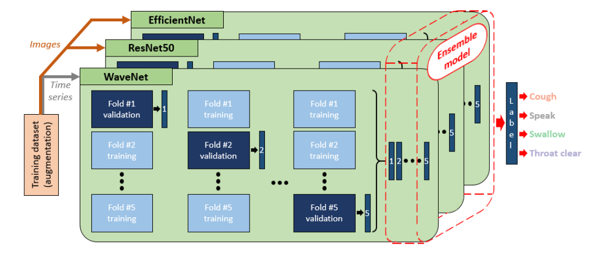

# Neurological disorder events classification

This project includes classification model used in “Highly accurate multi-domain deep ensemble model to detect neurological disorder symptoms with soft skin-attachable throat vibration sensor” reported in npj Digital Medicine.

Citable paper is coming soon.

    Authors: Yonghun Song, Inyeol Yun, Sandra Giovanoli, Chris Awai, and Yoonyoung Chung*
    Contact: yhsong@postech.ac.kr
    Institute: Department of Electrical Engineering, Pohang University of Science and Technology, 77 Cheongam-ro, Nam-gu, Pohang, Gyeongbuk, 37673, Korea and cereneo Foundation, Center for Interdisciplinary Research (CEFIR), 6354 Vitznau, Switzerland
    

Recording Data
----------

* Neurological symtoms: coughing, spekaing, swallowing, and throat clearing
* Subjects: 16 Korean (M: 11, F: 5), 2 American (M: 1, F: 1), 5 France (M: 2, F: 3), 6 German (M: 5, F: 1), 3 Spanish (M: 1, F: 2)
* Using soft skin-attachable throat vibration sensor (SVS)
* At Pohang University of Science and Technology (POSTECH) in South Korea and cereneo Foundation in Switzerland. 

Preprocessing
----------

* Normalization
* Processing with modified 1-D Kalman filter ([<https://ieeexplore.ieee.org/abstract/document/9954780>])
* Augmentation (flipping, moving, scaling, and noise injection)
* Segmentation
* Data transformation: waveform, fundamentatl frequcny (F0), spectrogram, and mel spectrogram

Dataset
----------

* Training (12 subejcts): 1,984 coughing, 2,107 speaking, 2,028 swallowing, and 2,089 throat clearing
* Test (20 subejcts): 150 coughing, 333 speaking, 161 swallowing, and 148 throat clearing

Model
----------

* Deep Neural Networks: WaveNet, ResNet50, and EfficientNet-b0 
* Stacking Ensemble Methods: gradient boosting machine (GBM), random forest (RF), extreme gradient boosting (XGBoost), LightGBM, extra trees, adaptive boosting (AdaBoost), and support vector machine (SVM) 

